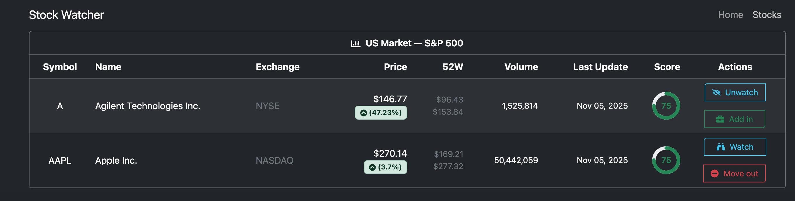

# Stock Monitoring Client

Project status: frozen due to high pricing in Europe stock APIs.

Frontend for the Stock Monitoring app. It pairs with the Cloudflare Worker backend at https://github.com/GeorgeLinardis/Stock-monitoring_wrangler-worker for market data and scoring.

## What it does
- Dashboard header showing portfolio totals, capital, and daily change metrics.
- Stocks table for US market listings with price, 52-week range, volume, last update, and score badge.
- Watchlist/portfolio action buttons per stock (watch/unwatch, add/remove).
- Stock score route for detailed scoring pages (`/stock-score/:symbol`).

## Tech stack
- React + Vite
- React Router for client-side routing
- Bootstrap 5 for layout and styling
- React Icons for UI glyphs
- Decimal.js for precise numeric math
